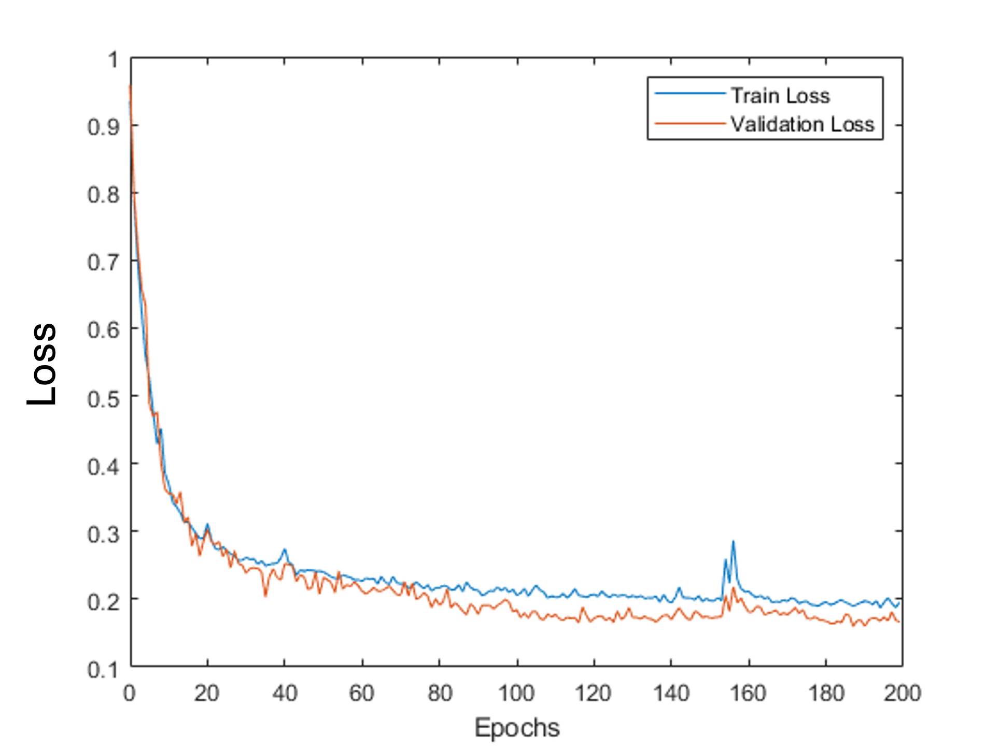
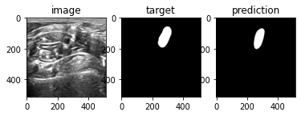
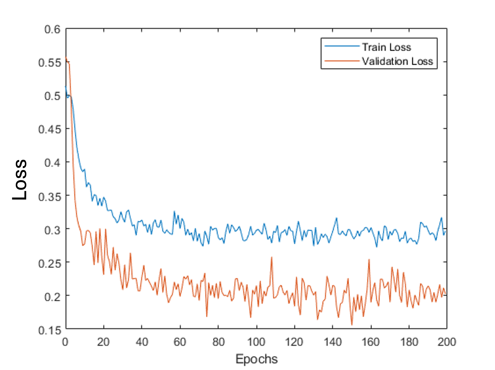

# Kaggle Challenge - Ultrasound Nerve Segmentation

## Repo Structure

I built this entire repo with ease-of-use in mind. It contains all the necessary functions/modules to train the network, test network, and generate submission file for the challenge. For enviornment sepcifications (I try to keep it minimal), please refer to [Environment and Package](#environment-and-packages) section.

Everything is organzied in folders (modules) based on their respective functions. The `API.py` provides easy access to functions that ultize the modules for aforementioned tasks.

The parameters specification for each training experiment can be hard to keep track of. For this reason, I utilize `json` files for storing and providing training instructions.

Please feel free to take a look at the provided [`Notebook.ipynb`](./Notebook.ipynb) to see how training and testing were done using this repo, and three example `json` files for customization of training. 

## Overview

This is a summary of my attemp at the [Ultrasound Nerve Segmentation](https://www.kaggle.com/competitions/ultrasound-nerve-segmentation/overview)

The tasks aim to perform bianary segmentation of Brachial Plexus (BP) in ultrasound image. An example is shown below

## Aim

The performance of proposed approach will be evaluated based on DICE score.

While the higher DICE score the better, given the limited time, it's probably going to be hard to beat top ranking scores. So I need a more achievable goal that can demonstrate I have applied deep learning in a meaningful way for this challenge.

Therefore, I submitted a **null test**, basically predicting zeros masks for all test data. If my approach was able to **have higher score than null test**, then the deep learning method I developed is likely able to extract useful information from the training data.

Here is the score to beat:

## Data Inspection & Processing

Good understanding of data characteristics is key to successful deep learning methods. Therefore, I started by looking at the data provided. And one issue immediately jumpped out:

### Class imbalance issue

Upon first inspection of provided `train_mask.csv`, many of the masks are empty (**3312 out of 5635**). 

* This huge imbalance in negative class can cause network get stuck in local minima where it predicts **all zeros**.
* This is also evident in the null score which is already relatively high

Therefore, the first step is to divide data based on if BP is present inside an image, creating subsets of **"BP-present"** (2323 images) and **"BP-absent"** (3312).

Then the partition of datasets for training was based on subject ids (47 in total) instead of just index of images to maximally avoid cross contamination. 

* BP-present subset: 2323 images in total 
  * Training: **subject 1-41**, (2031 images)
  * Validation: **subject 42-47**, (259 images) 
  * Test: **subject 47** (33 images)
* BP-absent subset: 3312 images in total
  * Training: **subject 1-41** (2885 images)
  * Validation: **subject 46** (340 images)
  * Test: **subject 47** (87 images)

(note that although the challenge provided test dataset, it does not include ground truth label, so it will be difficult to analyze the performance)

### Poor data quality (contradictory labels)

I realized this issue after a couple failed attempts to train the network to perform well. Upone close inspection of some of the data provided, I realized that there are contradictory labels for some of the images:

* For some images from the same patient, although they are clearly showing similar structure, one can have a segmentation label while the another has empty label. An example is shown below

Upon search in the discussion section of the Kaggle challenge, other users have reported the [same issue](https://www.kaggle.com/competitions/ultrasound-nerve-segmentation/discussion/21081#123201). And here is another image demonstrating the same issue reported by [another user](https://fhtagn.net/prog/2016/08/19/kaggle-uns.html)

I re-implemented one of the suggested method for filtering out such data [[ref]([13_clean/0_filter_incoherent_images.ipynb](https://github.com/julienr/kaggle_uns/blob/master/13_clean/0_filter_incoherent_images.ipynb))], which is based on histogram matching with cosine distance for recoginizing similar images.

In the end, 2237 images were excluded from the data for training, validation, and test.

### Pre-processing of data

Due to the time limit, preprocessing of data was focused on the basics: normalization, resizing, and BCE weighting computation to facilitate training. Please refere to [Future Work](#future-work) for what other preprocessing I would do if given more time.

All the following preprocessing steps were performed on-the-fly when loading data, built into [customized data loader class](./data/dataHandler.py)

#### Normalization

A straight foward way of normalizing images would be to just divide by 255, because all images are in `uint8`. However, we can perform dataset-wise Z-score normalization after reading images to bring all data into relatively close and normalized distribution, which would make it easier for training.

$$x = \frac{x-\mu}{\sigma}$$

With mean and standard deviation accumateled from all images: $\mu = 99.4072, \sigma= 56.5949$

#### Resizing

The images and labels will be rescaled to size of nearest $(2^m,2^n)$ before passing into the network (580,420) --> (512,512). There are two reasons for this:

* Typical network for segmentation, e.g. U-Net, involves series of downsampling and upsampling. Working with image size that's power of 2 insures the preservation of images size, and input scalability.
* Pytorch's interpolation function for such operation can introduce inherent errors and is [non-deterministic](https://discuss.pytorch.org/t/non-deterministic-behavior-of-pytorch-upsample-interpolate/42842), which is worse when output size is not multiple or divisible by input size. Resizing image prior to inference can ensure interpolation within network operates with divisible sizes, reducing such error. 

#### BCE weighting Calculation

As mentioned before, the imbalance of positive pixels and negative pixels (even in non-empty masks) can cause network to take a "shortcut" of just predicting zeros. To balance this, a weighting term for BCE loss computation should be provided based on ratio between positive and negative pixels

* when loading the masks, count number of positive pixels and number of negative pixels, $N_{pos},N_{neg}$
* use $\frac{N_{neg}}{N_{pos}}$ as weight parameter for `torch.nn.functional.binary_cross_entropy_with_logits`

### Data Augmentation

The data provided, after removal of contradictory data, is realtively limited (3398). Therefore, to prevent overfitting, data augmentation strategies are implemented

The following strategies are also implemented to perform on-the-fly when loading the data, incorperated into [customized data loader class](./data/dataHandler.py)

* random flip: 50% chance of flipping data horizontally, followed by 50% chance of vertical flipping
* random rigid transformation: $\pm5$ pixel shift in $H,W$ dimension, $\pm 5$ degree of random rotation
* noise injection: Guassian noise with $\sigma=2$% of the mean of the image
* random crop: images are randomly cropped from [512,512] to [384,384] 
  * the choice of 384 is because it is $6\times 2^5$, where 5 is the depth of my current network maxpooling dimension reduction
  * Also, the cropping does not affect network performance because CNN is input-scalable. So applying trained network on 512x512 images would still work

Note that except noise injection, other augmentations are performed on both image and mask to preserve spatial alignment, i.e. the integrity of labels

## Approach

Due to the clear challenge of vast presence of empty masks, directly train a network would be difficult. I initially planned to try out the following two approaches individually, but ended up with a **combination of the two**.

(I later thought of a thrid approach but didn't have the time to try it out, please refer to [Future Work section](#future-work))

### 1. Two networks for two tasks:

* A binary classification network deciding if BP is inside the image
  * Trained on both BP-present and BP-absent images
* A binary segmentation network segment BP from BP-present images
  * Trained (mostly) BP-present images 

### 2. Mixing in empty masks:

* During the initial round of training, the network would go through all BP-present data but only a specificed (small) number of BP-absent data that are randomly selected
* Once converged, do transfer learning with entire dataset

Either of these approaches would **need to train a segmentation network** that performs well on BP-present data, so I decided to start from there. 

Before we start training network, we also need to choose loss function

### Loss Functions

Binary Segmentation --> **wighted BCE loss** (to account for class imbalance, with weighting term $\frac{N_{neg}}{N_{pos}}$ determined in pre-processing step)

Also, **modified DICE** with squared denominator impelmentation for class imbalance [[ref](https://arxiv.org/pdf/1606.04797)] and also smoothing of 1 on both nominator and denominator 

$$DICE = \frac{2\sum pq +1}{\sum p^\mathbf 2 + \sum q^\mathbf 2 +1}$$

DICE is more sentitive to small structures, while the BCE loss can be influenced more by the negative masks (although partially compensated by weighting). The combination of the two should yield more reliable segmentation results

## Segmentation Network

### Standard U-Net

As the "gold standard" approach in segmentation tasks, U-Net is often the first choice and a baseline for comparison. For quickly testing, I used a semi-customizable U-Net model from [Pytorch Hub](https://pytorch.org/hub/mateuszbuda_brain-segmentation-pytorch_unet/) as a starting point.

#### Overfitting problem

After a couple of attemps, the U-Net always overfits to the training, when training loss continuously going down while the validation loss goes up, as shown below. **Neither heavy data augmentation nor smaller network could help**

This is likely due to a combination of **complex image features,** **relatively limited data**, **simple training label**. This caused network to **memorize the label** associated with each image instead of extracting generalizable features. 

### Solution: Custom Multi-Resolution Network with Dropout in-between Convolutional Layers

This is based on an architeture I previously used that worked well in registration problem. It has a multi-level, encoder-decoder design with inter-level communication. One big advantage here is that this network is configurable to have dropout layers in encoder, decoder, and bottleneck. 

#### Resolved overfitting with dropouts

With dropouts added for all convolutional blocks (please refer to [training configuration](./trainingConfig.json) for detailed network configuration settings). The overfitting problem was resolved, and validation loss was consistently lower than training loss.

The consistent lower validation loss is expected because dropout basically makes network to train sub networks at each inference during training, but for validation, once all dropouts were turned off, the network is an ensemble of sub networks and therefore, is more robust.

#### Test Results

The test dataset consists of 23 BP-present images, the customized network achived mean DICE score of **0.61** for all these cases. An example is shown below:

Unfortunately, directly apply this network to BP-absent test data does not work: predictions consisted of false positive for all 78 BP-absent images (Shown below). But this was to be expected, and would be addressed in the subsequent transfer learning stage.

### Transfer Learning to Improve Negative Detection

Network was trained, with previous weights loaded, on the entirety of training data, i.e. BP-absent images included. The loss initially jumped up, as expected, due to introducing out-of-domain data. But was able to converge once again

The network did not seem to forget how to extract true positive masks, and infact, improved its performance with average DICE of **0.65** for **all** 23 BP-present images. The improvement performance maybe explained by that the network has now seen what false positive structures look like and therefore, have better understand of correct segmentation.

While at the same time able to predict true negative in many cases (**56** out of **78**)

However, the specificity of the network, i.e. ability to correctly identify false positive, is not as good as desired to operate alone (**22** out of **78** cases are still reported false positive)

Therefore, I decided to move on to the next part, to train a classification network to help futher detect negative cases before applying segmentation.

## Classification Network

The task of classification network is to decided if BP is present inside an image before passing it to the segmentation network. If BP is not present, then the mask will simply be empty

### Standard VGG

Although proposed a decade ago, VGG can still be good starting point for classification tasks. I used VGG11 with batchnorm from PyTorch Hub as an inital starting point. 

#### Overfitting

Similar to applying standard U-Net, the VGG network overfit rather quickly in my inital attemps. Again, increased data augmentation and smaller network did not help much

The overfitting occured much ealier is likely because the training label is now just a single classication number, which is much simpler. So network can **easily memorize the label**.

## Solution: Modified Custom Multi-Resolution Network

I then resort to my previosuly used network architeture, with modification to make it work with single number outputs. Dropout layers were again added throughout the network as a regularization to prevent overfitting.

#### Training Classification network

The custom network did not overfit easily, but the validation loss appeared to be unstable, which could benefit from [further investigation](#future-work)

#### Test Results

Upon testing on test dataset, the network has the following performance

| Accuracy | Precision | Recall (Sensitivity) | Specificty |
| -------- | --------- | -------------------- | ---------- |
| 0.753    | 0.667     | 0.435                | 0.821      |

While the specificity looks okay, the recall value is quite low, which means that in final evaluation, it's likely that many of the positive cases will be marked as empty, which will significantly degrades DICE score.

## Ad-hoc Fixes

### Initial Submission

Just as a baseline study, I submitted the results I obatined from combining the two networks. However, the evaluation results were quite poor, siginificantly lower than even the null test

While removing the classification step actually yielded better results. This confirmed that the poor recall value indeed had a negative impact.

### Classification

While a better way to address poor classification performance is to adjust network design and finetune training hyperparameters for better performance, I unfortunately did have enough time. So I tried an ad-hoc fix that didn't increase the performance of the classification network itself, but insteaded, tailored its performance to the overall task.

Recall that the segmentation network can still pick out many of the negative cases. Therefore, classification only needs to help with negative detection. With that in mind, as an ad-hoc fix, I moved the classification cutoff of the network output logits to negative -1, which increased recall to 1, but degraded specificty to 0.141. 

### Segmentation

It's clear that the segmentation network can distinguish a part of the negative cases, so the network mush have learned something. In close inspection of the mask predicted by the network from the test dataset: 

* the true positive masks have number of positive pixels in range of  [6772, 9259]
* the false positive masks have number of positive pixels in range of [5140, 8970]

Therefore, we can rule out a few more false positive cases by applying a thresholding based on number of positive pixels. For final submission, I set the threshold to be 6000.

## Final Submission

Proper post-processing was applied to network output to recale it back to original size and encode it in RLE format.

Here is the results I obtained using the trained networks and the aforementioned ad-hoc fixes, I was able to bring up the final DICE score above the null test results.

## Future Work

If given more time, here are a list of things I can do to futher improve the performance of my approach

### The Third Approach

The segmentation and classificaiton network actually shared about half of the architeture. Therefore, it's possible to combine them into one network that are trained on two tasks simultaneously. This not only increased the complexity of the network output (reducing overfitting) but makes features extracted by network more general and consistent for the two closely related tasks.

### Additional Pre-Processing: Extra Features from Input Data 

The overfitting is a potential sign that the input features to the network is not sufficient. Therefore, another way to address it is to extract extra features from the input data. This could potentially be an important aspect, because ultrasound images (at least for provided data) are relatively monochrome and have low contrast and definination in soft tissue regions. A few examples are listed below

* Image gradient
* Edge
* Transformations of image (Fourier Transform, Gabor Filter, Wavelet Decomposition)
* Piror generated from existing tools, which can be deep learning-based (e.g. [total segmentator](https://github.com/wasserth/TotalSegmentator)) or traditional (e.g. [SNAKE: Active Contour](https://link.springer.com/article/10.1007/BF00133570))

### Additional Post-Processing

The segmentation results from the neural network can be futher refined, including:

* Morphological operations, such as dilation, erosion, hole filling, and dust removal.
* PCA fitting of training masks, and reconstruct prediction

The are also ways to perform aleatoric and epistemic uncertainty study of neural network, which can help refine the output based on statistics ([example](https://pubmed.ncbi.nlm.nih.gov/36906915/))

### Better Training Starting Point

#### Unsupervised Pre-training via Autoencoder

The encoder of regmentation and classification networks can be pre-trained by auxiliary tasks to help extract generalizatable features. Some examples:

* Jigsaw puzzle
* Filling blanks
* Image reconstruction

#### Leverage Fundation Models

Fundation models have become more and more available and can generally perform well in their designed domain. For ultrasound, [USFM](https://www.sciencedirect.com/science/article/abs/pii/S1361841524001270) recently came out, showing some very convincing results. 

### Finally...More Hyperparameter Tuning

A seemingly "mundane" yet an integral part of training a high-performance model. 

The reason I built the whole training pipe based on `.json` configuration files is for easy documentation and systematic hyperparameter search. Although I didn't do much tuning for this challenge, 

Additionaly, there is a framework that I have been working on to incorperate into neural network training. It's called [**NeverGrad**](https://facebookresearch.github.io/nevergrad/). And one of its intended purpose is for hyperparameter search for network training. Adding this to the pipeline will help streamline the process and allow us to focus on other tasks (data processing, architeture design, training strategies, post-processing, etc.)

## Environment and Packages

Python: 3.9

NumPy: 1.23.5

Pytorch: 2.5 ('+cuda118')

Cuda: 11.8

Additona packages: pandas, matplotlib, scipy, tqdm, scikit-image, glob